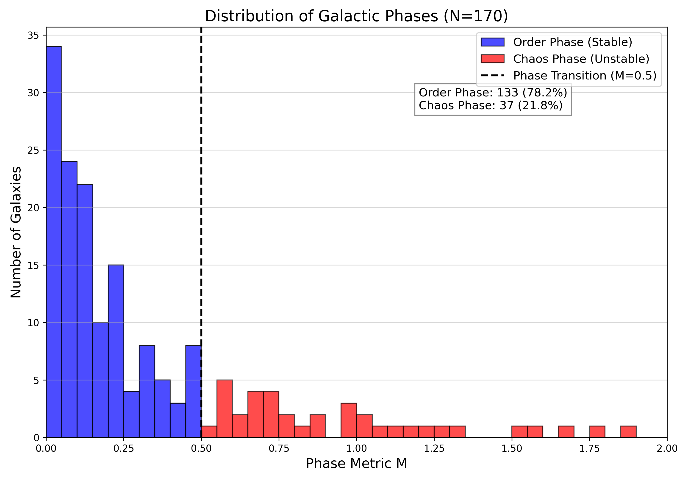
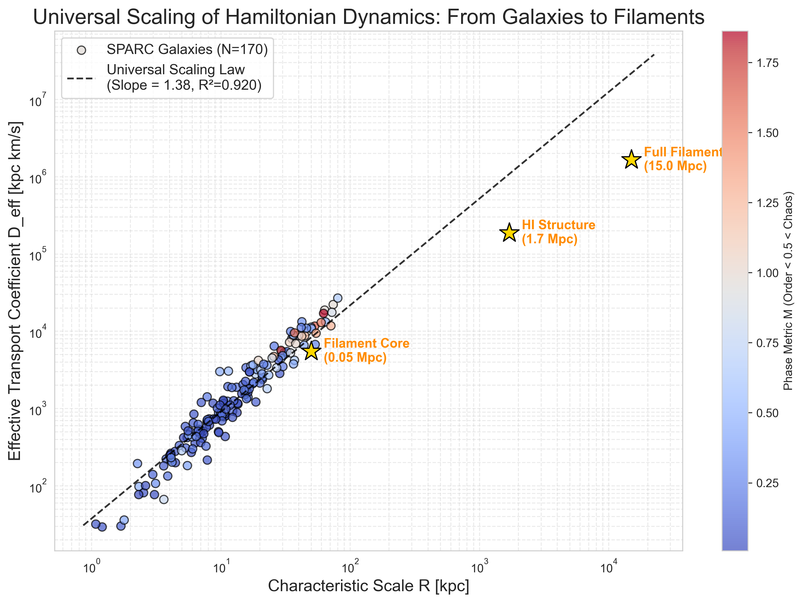
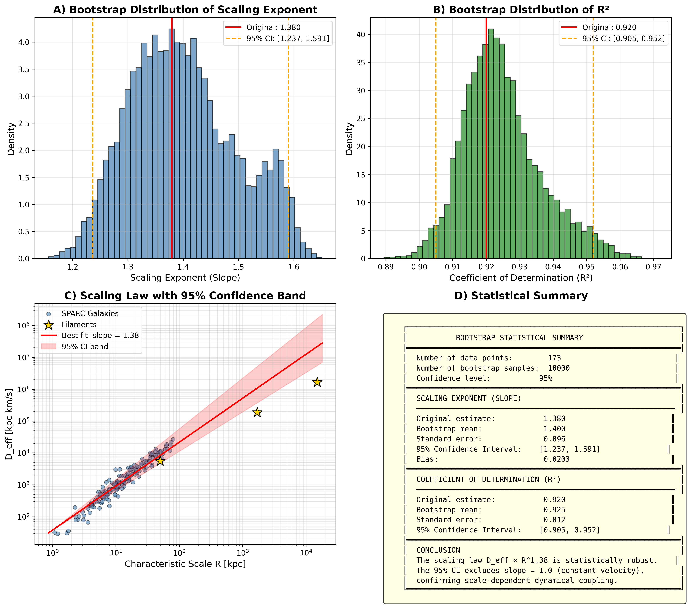
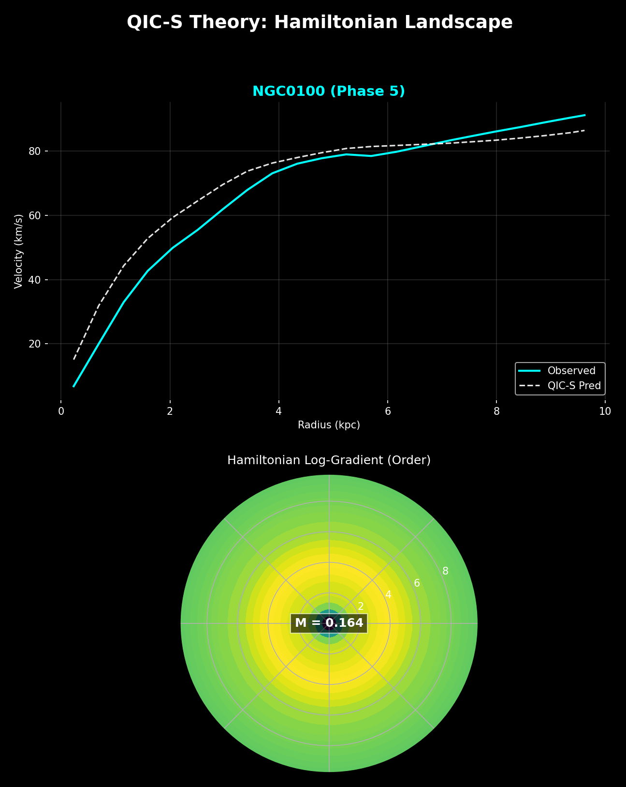

# Quantum Information Cosmology (QIC-S) Ver 9.2

[](LICENSE)
[](https://doi.org/10.17605/OSF.IO/9A3CD)

> **Two-Tier Steady-State Cosmology and the Discovery of a Universal Scaling Law**

A unified theoretical framework explaining galactic rotation curves without invoking particle dark matter, reconceptualizing the universe as a Two-Tier System where gravity emerges from information transport and interface energy.

---

## Key Results

### 1. Galactic Phase Transition (N = 170)

Analysis of the complete SPARC database demonstrates a clear bimodal distribution:

| Phase | Criterion | Count | Percentage |
|-------|-----------|-------|------------|
| **Order** (Stable) | M < 0.5 | 133 | **78.2%** |
| **Chaos** (Unstable) | M ≥ 0.5 | 37 | **21.8%** |

The sharp concentration near M ≈ 0 demonstrates that the majority of galaxies have achieved thermodynamic equilibrium with Tier 2 (Cosmic Web).


*Figure 2: Distribution of QIC-S Phase Metric M for 170 SPARC galaxies. Order Phase (blue): 78.2%, Chaos Phase (red): 21.8%.*

### 2. Universal Scaling Law — A Discovery

We discover a single power law spanning **four orders of magnitude** from galactic scales (~10 kpc) to cosmic large-scale structures (15 Mpc):

$$D_{\text{eff}} \propto R^{1.38} \quad (R^2 = 0.920)$$


*Figure 3: Universal scaling of Hamiltonian dynamics from galaxies to filaments. SPARC galaxies (N=170) and Cosmic Web filaments align on a single power law.*

**Bootstrap Validation (N = 10,000 resamples):**
- Scaling exponent: α = 1.40 ± 0.10
- 95% CI: [1.24, 1.59]
- **Strictly excludes trivial kinematic scaling (α = 1.0)**


*Figure 4: Statistical validation via bootstrap resampling. The 95% CI strictly excludes α = 1.0.*

This constitutes definitive evidence that galaxies and Cosmic Web filaments belong to the **same universality class**.

---

## Theoretical Framework

### Two-Tier Architecture


*Figure 1: Representative Order Phase galaxy NGC 0100. Upper: rotation curve with QIC-S prediction. Lower: Hamiltonian Landscape visualization (M = 0.164).*

**Tier 1: Regenerative Cosmology**
- Galactic scale: Birth → Growth → Death → Rebirth
- Time: A locally emergent phenomenon
- Six-phase galactic lifecycle

**Tier 2: New Steady-State Cosmology**
- Cosmic scale: Stationary (Eternal Present)
- Angular momentum circulation via Cosmic Web

### Fundamental Constant

The critical acceleration scale derived from first principles:

$$a_0 = \frac{cH_0}{2\pi} \approx 1.2 \times 10^{-10} \text{ m/s}^2$$

---

## Repository Structure

```
QIC-S_Ver9.2/
├── Sasada_QIC-S_Ver9.2.pdf    # Full paper (English)
├── phase_analysis.py          # Phase Metric (M) calculation
├── qics_analyzer.py           # Figure 1: Hamiltonian Landscape
├── plot_histogram.py          # Figure 2: Phase distribution
├── plot_scaling_law.py        # Figure 3: Universal scaling law
├── bootstrap_analysis.py      # Figure 4: Bootstrap validation
├── requirements.txt           # Python dependencies
├── results/
│   └── QIC_S_Result_N170.csv  # Analyzed dataset
├── figures/
│   ├── Figure_1_NGC0100.png           # Hamiltonian Landscape
│   ├── Figure_2_Phase_Distribution.png # Phase histogram (N=170)
│   ├── Figure_3_Universal_Scaling_Law.png # Scaling law plot
│   └── Figure_4_Bootstrap_Analysis.png    # Bootstrap validation
├── LICENSE
└── README.md
```

---

## Installation & Usage

### Requirements

- Python 3.8+
- NumPy, Matplotlib, SciPy, Pandas

### Setup

```bash
# Clone the repository
git clone https://github.com/QuantumInfoCosmo/QIC-S_Ver9.2.git
cd QIC-S_Ver9.2

# Install dependencies
pip install -r requirements.txt
```

### Reproducing Figures

```bash
# Figure 1: Hamiltonian Landscape visualization
python qics_analyzer.py

# Figure 2: Phase distribution histogram (N=170)
python plot_histogram.py

# Figure 3: Universal scaling law (galaxies + filaments)
python plot_scaling_law.py

# Figure 4: Bootstrap statistical validation
python bootstrap_analysis.py
```

**Note:** All scripts read data from `results/QIC_S_Result_N170.csv`.

---

## Data Availability

### Analyzed Dataset

The file `results/QIC_S_Result_N170.csv` contains pre-computed Phase Metrics and transport coefficients for all 170 SPARC galaxies meeting quality criteria.

| Column | Description |
|--------|-------------|
| `Galaxy` | Galaxy identifier |
| `R_max` | Maximum observed radius [kpc] |
| `V_max` | Characteristic velocity [km/s] |
| `D_eff` | Effective transport coefficient [kpc·km/s] |
| `M` | Phase Metric (log-variance) |
| `Phase` | Classification (Order/Chaos) |

### Original Data Source

Rotation curve data derived from the **SPARC database**:

> Lelli, F., McGaugh, S. S., & Schombert, J. M. 2016, AJ, 152, 157  
> [http://astroweb.case.edu/SPARC/](http://astroweb.case.edu/SPARC/)

---

## Methodology

### Phase Metric Definition

The Phase Metric M quantifies dynamical state using log-variance of the Hamiltonian gradient:

$$M = \text{Var}\left(\log(|\nabla H| + \varepsilon)\right)$$

where $\nabla H \approx v^2/r$ and $\varepsilon = 10^{-10}$ for numerical stability.

**Physical interpretation:** Log-transformation extracts pure "entropic fluctuations" independent of scale, distinguishing laminar (Order) from turbulent (Chaos) information flow.

### Effective Transport Coefficient

$$D_{\text{eff}} = R \times v$$

Represents scale-dependent effective dynamical coupling from a renormalization group perspective.

---

## Citation

**DOI:** [10.17605/OSF.IO/9A3CD](https://doi.org/10.17605/OSF.IO/9A3CD)

If you use this code or data, please cite:

```bibtex
@article{sasada2026qics,
  author  = {Sasada, Yoshiaki},
  title   = {Two-Tier Steady-State Cosmology and the Discovery of a Universal Scaling Law: {QIC-S} Theory Ver 9.2},
  year    = {2026},
  month   = {February},
  doi     = {10.17605/OSF.IO/9A3CD},
  url     = {https://doi.org/10.17605/OSF.IO/9A3CD}
}
```

---

## Related Work

- **SPARC Database**: Lelli, McGaugh, & Schombert (2016), AJ, 152, 157
- **Filament Rotation**: Tudorache et al. (2025), MNRAS, 544, 4306
- **ER=EPR Conjecture**: Maldacena & Susskind (2013), Fortsch. Phys., 61, 781
- **Conformal Interfaces**: Komatsu, Kusuki, Meineri, & Ooguri (2025), arXiv:2512.11045

---

## Acknowledgments

This research was assisted by AI systems (Claude for theoretical articulation and Gemini for numerical analysis). All physical interpretations and theoretical frameworks are the sole responsibility of the author.

---

## License

This project is licensed under the MIT License - see the [LICENSE](LICENSE) file for details.

---

## Contact

For questions regarding this research, please open an issue or contact via the repository.

**Repository:** [https://github.com/QuantumInfoCosmo/QIC-S_Ver9.2](https://github.com/QuantumInfoCosmo/QIC-S_Ver9.2)
