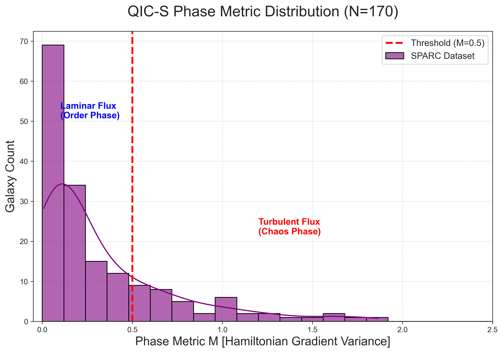

# QIC-S Theory Ver 9.1: Two-Tier Steady-State Cosmology

[](https://doi.org/10.17605/OSF.IO/9A3CD)
[](https://creativecommons.org/licenses/by/4.0/)
[](https://www.python.org/)

---

## Overview

**Quantum Information Cosmology (QIC-S)** is a theoretical framework that explains galactic rotation curves and cosmic large-scale structures through information thermodynamics — **without invoking particle dark matter**.

This repository presents **Ver 9.1**, which establishes:

1. **Statistical Verification (N=170)**: 78.2% of SPARC galaxies reside in the thermodynamically stable "Order Phase"
2. **Universal Scaling Law Discovery**: D_eff ∝ R^1.38 spans four orders of magnitude from galaxies (~10 kpc) to cosmic filaments (15 Mpc)
3. **Statistical Robustness** *(New in Ver 9.1)*: Bootstrap analysis (N=10,000) confirms α = 1.40 ± 0.10 with 95% CI [1.24, 1.59], strictly excluding α = 1.0

---

## Key Results

### Phase Metric Distribution

The **Phase Metric M** quantifies galactic evolutionary states:

```
M = Var(log(v²/r))
```

| Phase | Criterion | Count | Percentage |
|-------|-----------|-------|------------|
| **Order** (Mature) | M < 0.5 | 133 | 78.2% |
| **Chaos** (Germinating) | M ≥ 0.5 | 37 | 21.8% |



### Universal Scaling Law

```
D_eff ∝ R^1.38  (R² = 0.920)
```

This single power law connects:
- Individual galaxies (~1–80 kpc)
- Cosmic filament cores (~50 kpc)  
- HI structures (~1.7 Mpc)
- Full filaments (~15 Mpc)


### Statistical Validation (Ver 9.1)

Bootstrap analysis (10,000 resamples) confirms:

| Parameter | Value | 95% CI |
|-----------|-------|--------|
| Scaling Exponent (α) | 1.40 ± 0.10 | [1.24, 1.59] |
| R² | 0.925 ± 0.012 | [0.905, 0.952] |

**The 95% CI strictly excludes α = 1.0**, confirming scale-dependent dynamical coupling.


---

## Theoretical Framework

### The Two-Tier Architecture

| Tier | Name | Scale | Characteristic |
|------|------|-------|----------------|
| **Tier 1** | Regenerative Cosmology | Galactic | Birth → Growth → Death → Rebirth |
| **Tier 2** | New Steady-State Cosmology | Cosmic | Global stationarity via Cosmic Web |

**Biological Analogy**: Just as individual cells undergo apoptosis while the organism maintains homeostasis, galaxies cycle through evolutionary phases while the universe maintains steady-state equilibrium.

### Fundamental Constant

```
a₀ = cH₀ / 2π ≈ 1.2 × 10⁻¹⁰ m/s²
```

This provides a **zero-parameter foundation** for all calculations.

---

## Repository Structure

```
QuantumInfoCosmo_NGC2403/
├── README.md
├── requirements.txt
├── .gitignore
│
├── Sasada_QIC-S_Ver9.1.pdf          # Full research paper
├── Sasada_QIC-S_Ver9.1.tex          # LaTeX source
│
├── phase_analysis.py                 # Phase Metric calculation (Fig 2)
├── plot_scaling_law.py               # Scaling law visualization (Fig 3)
├── qics_analyzer.py                  # Individual galaxy analysis (Fig 1)
├── bootstrap_analysis.py             # Statistical validation (Fig 4) [NEW]
│
├── data/                             # SPARC rotation curve data
│   └── *_rotmod.dat
│
├── results/
│   ├── QIC_S_Result_N170.csv         # All galaxy metrics
│   └── Bootstrap_Statistics.txt      # Detailed statistics [NEW]
│
├── Fig1_Individual_Verification.png
├── Fig2_Phase_Histogram.png
├── Fig3_Scaling_Law.png
└── Fig4_Bootstrap_Analysis.png       # [NEW in Ver 9.1]
```

---

## Quick Start

### Requirements

```bash
pip install numpy pandas matplotlib scipy seaborn
```

### Run Analysis Pipeline

```bash
# Step 1: Calculate Phase Metrics for all galaxies
python phase_analysis.py
# Output: results/QIC_S_Result_N170.csv, Fig2_Phase_Histogram.png

# Step 2: Generate Universal Scaling Law plot
python plot_scaling_law.py
# Output: Fig3_Scaling_Law.png

# Step 3: Perform Bootstrap statistical validation
python bootstrap_analysis.py
# Output: Fig4_Bootstrap_Analysis.png, results/Bootstrap_Statistics.txt

# Optional: Analyze individual galaxies
python qics_analyzer.py --file1 data/NGC6503_rotmod.dat --file2 data/UGC00128_rotmod.dat
# Output: Fig1_Individual_Verification.png
```

---

## Data Sources

| Dataset | Description | Reference |
|---------|-------------|-----------|
| **SPARC** | Spitzer Photometry & Accurate Rotation Curves (175 galaxies) | [Lelli et al. (2016) AJ 152:157](https://ui.adsabs.harvard.edu/abs/2016AJ....152..157L) |
| **Filament** | 15 Mpc rotating cosmic filament | [Tudorache et al. (2025) MNRAS 544:4306](https://doi.org/10.1093/mnras/stae2246) |

---

## Testable Predictions

| # | Prediction | Status |
|---|------------|--------|
| 1 | LRD-Quasar Transition Objects via JWST | Pending |
| 2 | Interface density gradients steeper than NFW | Pending |
| 3 | Filament rotation follows same scaling law | ✅ Verified |
| 4 | 78.2% of galaxies in Order Phase (M < 0.5) | ✅ Verified |
| 5 | Universal Scaling Law D_eff ∝ R^1.38 | ✅ Discovered |
| 6 | Statistical robustness (95% CI excludes α=1.0) | ✅ Confirmed |

---

## Version History

| Version | Date | Changes |
|---------|------|---------|
| **9.1** | 2026-02-04 | Added Bootstrap analysis, Fig 4, statistical validation |
| 9.0 | 2026-02-04 | Initial release with N=170 analysis and scaling law discovery |

---

## Citation

```bibtex
@article{Sasada2026QICS,
  title   = {Two-Tier Steady-State Cosmology and the Discovery of a 
             Universal Scaling Law: QIC-S Theory Ver 9.1},
  author  = {Sasada, Yoshiaki},
  year    = {2026},
  month   = {February},
  note    = {Independent Researcher},
  doi     = {10.17605/OSF.IO/9A3CD},
  url     = {https://github.com/QuantumInfoCosmo/QuantumInfoCosmo_NGC2403}
}
```

---

## Related Links

- **OSF Project**: [doi.org/10.17605/OSF.IO/9A3CD](https://doi.org/10.17605/OSF.IO/9A3CD)
- **SPARC Database**: [astroweb.cwru.edu/SPARC](http://astroweb.cwru.edu/SPARC/)

---

## Acknowledgments

- **SPARC Database**: Lelli, F., McGaugh, S. S., & Schombert, J. M. (2016)
- **Filament Data**: Tudorache, M. N. et al. (2025)
- **AI Assistance**: Claude (theoretical articulation) and Gemini (numerical analysis)

All physical interpretations and theoretical frameworks are the sole responsibility of the author.

---

## License

This work is licensed under [CC BY 4.0](https://creativecommons.org/licenses/by/4.0/).

© 2026 Yoshiaki Sasada. All rights reserved.
