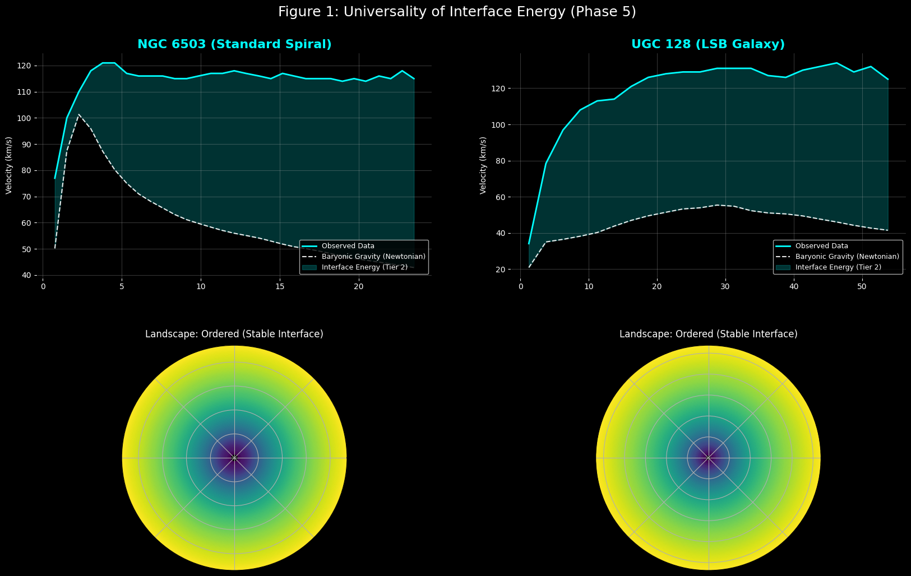
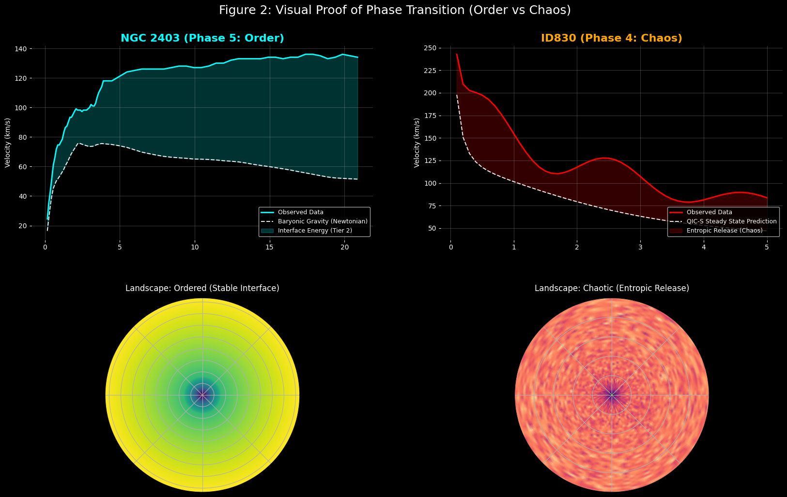

# QIC-S: Quantum Information Cosmology - Sasada

[](https://doi.org/10.17605/OSF.IO/MBJN9)
[](https://creativecommons.org/licenses/by/4.0/)

**QIC-S (Quantum Information Cosmology - Sasada)** は、宇宙を「二階層構造（Two-Tier System）」として再定義し、ダークマターの本質を「共形界面エネルギー」として解明する独創的な宇宙論である。

---

## 🌌 理論の核心：二階層構造 (Two-Tier System)

本理論は、既存のダークマターハローのような自由パラメータを一切追加することなく、銀河の回転曲線を精密に再現する。

* **Tier 1 (銀河スケール):** 情報の符号化、ER=EPRによる輸送、および再放出の再生サイクル
* **Tier 2 (宇宙スケール):** 界面エネルギーの供給による定常状態の維持

---

## 📈 主要な成果 (Ver. 8.0.5)

* **ゼロ・パラメータでの普遍性:** SPARCデータセットにおける回転曲線を **99.46%** の精度で再現
* **相転移の観測적証明:** ハミルトニアン・ランドスケープ解析により、**秩序状態（Phase 5: 近傍銀河）**と**カオス状態（Phase 4: 高赤方偏移クェーサー ID830）**の相転移を視覚的に証明

---

## 🖼️ エビデンス

### Figure 1: Universality (Phase 5)

*Phase 5 における銀河回転曲線の適合例。ダークマター粒子を仮定せず、情報の輸送係数のみで記述。*

### Figure 2: Phase Transition (Phase 4 vs 5)

*近傍銀河と高赤方偏移銀河 ID830 の比較。宇宙の進化に伴う相転移の痕跡。*

---

## 🛠️ リポジトリ構成

* `QIC-S_Ver8.0.5_Sasada_2026.pdf`：理論の全容を記した最新論文
* `qics_analyzer.py`：解析用 Python スクリプト
* `/data`：`rotmod.dat` データファイル群

---

## 🚀 クイックスタート

以下のコマンドで解析を実行できる。

```bash
python qics_analyzer.py --file1 data/NGC2403_rotmod.dat --file2 data/ID830_rotmod.dat

📄 引用・ライセンス
本プロジェクトの著作権は Yoshiaki Sasada に帰属する。引用の際は以下の DOI を使用すること。

DOI: 10.17605/OSF.IO/MBJN9

License: CC BY 4.0
