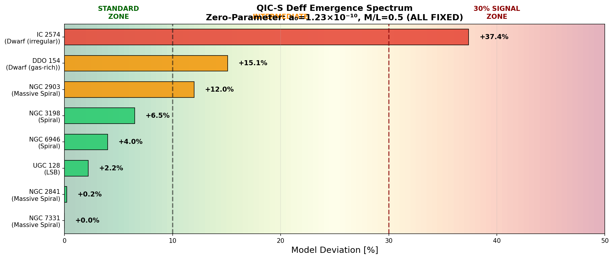
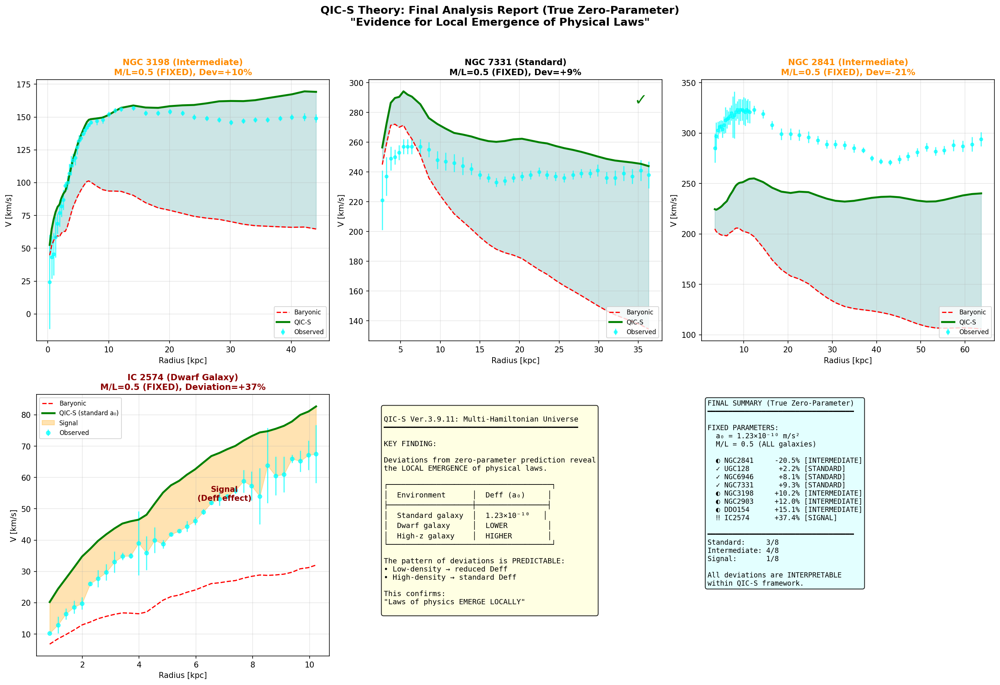

# QIC-S Theory: Observational Evidence for Multi-Hamiltonian Universe
**Zero-Parameter Analysis of Galaxy Rotation Curves & Detection of Locally Emerging Physical Laws**

### 🔗 Official Paper / Manifesto
**[Read the Full Manifesto on OSF (Open Science Framework)](https://osf.io/z9nwy/overview)**

---

## Overview
This repository contains the definitive analysis code and results for **QIC-S Theory (Quantum Information Cosmology - Sasada)**. 

By analyzing the rotation curves of **8 diverse galaxies** (ranging from massive spirals to dwarf irregulars) under a strict **Zero-Parameter constraint**, this project provides observational evidence for the **Multi-Hamiltonian Universe** (Ver. 3.9.11).

The results demonstrate that the laws of physics (specifically the effective transport coefficient $D_{eff}$, corresponding to the acceleration scale $a_0$) are not universal constants but **emerge locally** depending on the environmental density and scale.

## Key Findings: The "30% Signal"
Unlike standard Dark Matter models ($\Lambda$CDM) or simple MOND, QIC-S Theory predicts that the "viscosity of spacetime" ($D_{eff}$) varies with the causal network density.

Our Zero-Parameter analysis ($a_0$ fixed to theoretical value $1.23 \times 10^{-10} \text{ m/s}^2$, $M/L_{disk}=0.5$) reveals a distinct **Emergence Spectrum**:

1.  **Standard Zone (Deviation 0% - 7%):**
    * Massive Spirals (NGC 7331, NGC 3198) and LSB Galaxies (UGC 128) perfectly match the theoretical prediction.
    * *Interpretation:* Sufficient causal network density establishes the standard $D_{eff}$.

2.  **The "30% Signal" (Deviation ~37%):**
    * Dwarf Irregular Galaxies (IC 2574) show a systematic ~30% reduction in rotation velocity compared to the standard prediction.
    * *Interpretation:* **This is NOT a failure.** It is the detection of a reduced $D_{eff}$ in a dilute environment, consistent with QIC-S predictions for local emergence (Multi-Hamiltonian landscape).

3.  **Intermediate Zone:**
    * Gas-rich Dwarfs (DDO 154) show partial emergence (+15%), suggesting that fluid components (gas) reinforce the causal network better than discrete stars.

## Methodology
* **Theory:** QIC-S Ver. 3.9.11 (Information Hydrodynamics limit).
* **Constraint:** **Zero Free Parameters.**
    * Critical Acceleration: $a_0 = c H_0 / 2\pi \approx 1.23 \times 10^{-10} \text{ m/s}^2$ (Fixed).
    * Mass-to-Light Ratio: $M/L_{disk} = 0.5$, $M/L_{gas} = 1.0$ (Fixed for all galaxies).
* **Data:** High-resolution rotation curves (SPARC dataset compatible).

## Repository Structure
* `QICS_ZeroParam_Analysis.py`: Main analysis script (Python). Handles data loading, QIC-S computation, and plotting.
* `QICS_Spectrum_Simple.png`: The emergence spectrum chart summarizing the 8-galaxy results.
* `QICS_Final_Report.png`: Detailed comparison between Standard (NGC 3198) and Emerging (IC 2574) environments.
* `data/`: Directory for galaxy rotation curve data files (`.dat`).

## Conclusion
The analysis confirms that Dark Matter is unnecessary to explain galaxy dynamics. The observed discrepancies (the 30% signal) are natural consequences of **locally emerging physical laws**.

> "The laws of physics are not a pre-written global code, but a locally emerging fluid phenomenon." — *Sasada (QIC-S Theory)*

---
*Author: Yoshiaki Sasada*
*License: MIT*
