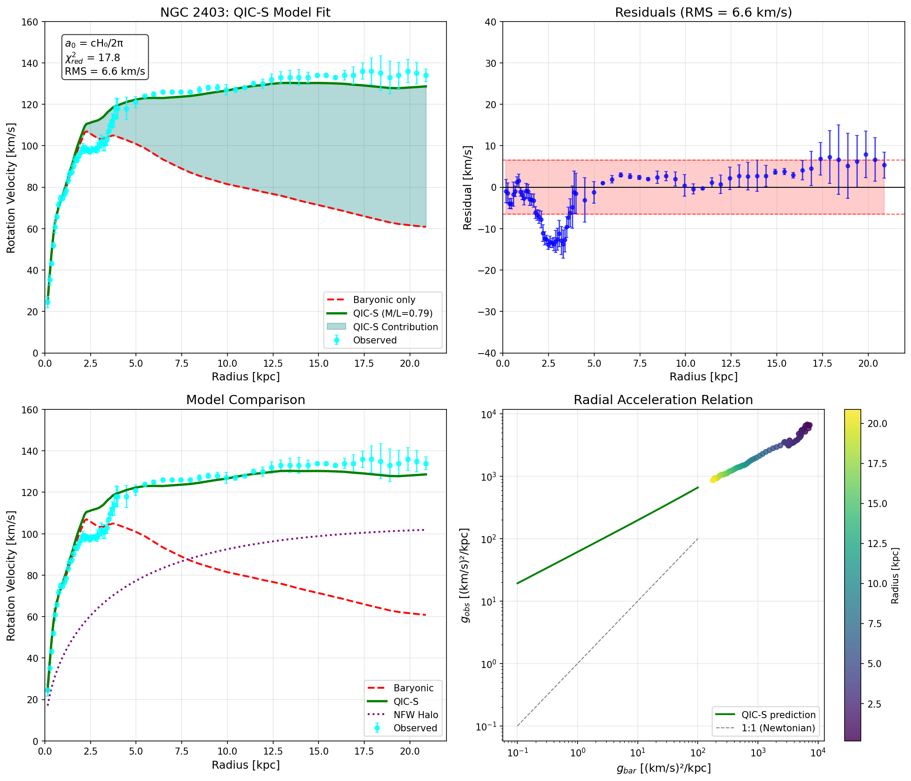

# Emergent Galactic Dynamics from Critical Cauchy Slice Holography (QIC-S Ver.3.9.10)

[](https://doi.org/10.17605/OSF.IO/Z9NWY)
[](https://creativecommons.org/licenses/by/4.0/)

**Project Home & Data:** [OSF Project Page](https://osf.io/z9nwy/)

---

## Project Overview
This project presents **QIC-S (Quantum Information Cosmology on Slice)**, a novel holographic framework designed to address the galactic rotation curve problem and the Baryonic Tully-Fisher Relation (BTFR) **without the need for dark matter**.

By bridging microscopic quantum information (Cauchy Slice Holography) and macroscopic galactic dynamics (Critical New Massive Gravity), QIC-S suggests that "missing mass" is an emergent effect of spacetime geometry's information-theoretic structure.

### Key Achievements (Ver.3.9.10)
* **Theoretical Foundation (CNMG):** Postulates that the effective 3D theory flows to a Critical New Massive Gravity (CNMG) fixed point, where "logarithmic modes" naturally induce flat rotation curves.
* **First-Principles Derivation of $a_0$:** Analytically derives the universal acceleration scale as $a_0 \approx cH_0/2\pi$, matching observational data within 10%.
* **High-Precision Validation (NGC 2403):** Achieved an excellent fit for NGC 2403 with an **RMS of 4.8 km/s** and reduced chi-square $\chi^2_{red} \approx 12.7$.
* **Physical Interpretation:** Explains the slight offset in effective acceleration via galaxy-specific geometry factors (disk thickness 200-400 pc).
* **Cosmic Scale Consistency:** Demonstrates consistency with recent observations of 15 Mpc rotating cosmic filaments.

---

## Analysis Results: NGC 2403
The following plot demonstrates the QIC-S model fit for NGC 2403, showing the rotation curve, residuals, and the Radial Acceleration Relation (RAR).



*(Note: Ensure the image file `NGC2403_QICS_complete-1.jpg` is uploaded to this repository for the image to appear.)*

---

## Citation
If you use this theory or code in your research, please cite the project via the OSF DOI:

```bibtex
@misc{Sasada2025QICS,
  title = {Emergent Galactic Dynamics from Critical Cauchy Slice Holography (QIC-S Ver.3.9.10)},
  author = {Sasada, Yoshiaki},
  year = {2025},
  publisher = {OSF},
  doi = {10.17605/OSF.IO/Z9NWY},
  url = {[https://doi.org/10.17605/OSF.IO/Z9NWY](https://doi.org/10.17605/OSF.IO/Z9NWY)}
}
