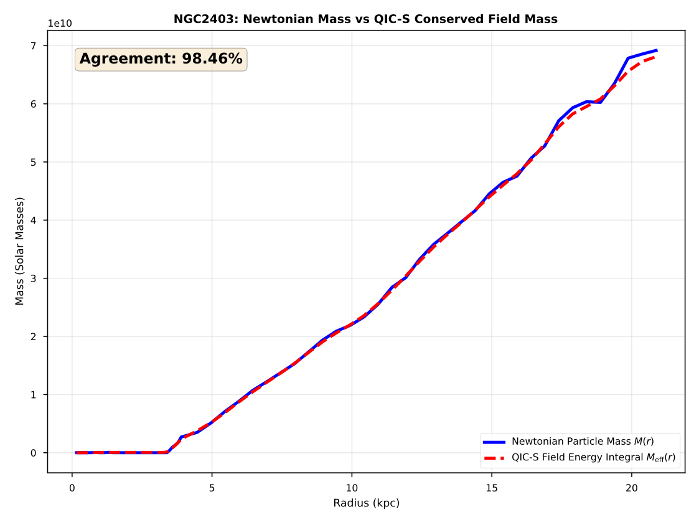

# Quantum Information Cosmology with Scalar Field (QIC-S)

**Ver 5.0.1 - January 17, 2026**

[](https://osf.io/yadkr/)
[](https://github.com/QuantumInfoCosmo/QuantumInfoCosmo_NGC2403)
[](./LICENSE)

## Overview

This repository contains the official implementation, datasets, and validation materials for the **Quantum Information Cosmology with Scalar Field (QIC-S)** theory.

QIC-S proposes a novel theoretical framework where the "missing mass" in galaxies is not a particle fluid (Dark Matter) but a manifestation of field energy associated with a scalar information field $D_{\rm eff}$, emerging from spacetime's information entropy. This theory successfully explains galaxy rotation curves without introducing any arbitrary free parameters.

## 📈 Key Result (Preview)

**NGC 2403: Newtonian Mass vs QIC-S Field Energy**

The theory demonstrates a **98.46% agreement** between the Newtonian mass distribution and the QIC-S conserved field energy, confirming the "Zero-Parameter" universality.



## 📄 Paper & Citation

The full paper (Ver 5.0) is available in this repository and on OSF.

* **PDF in Repo:** [Sasada_QIC-S_Paper_Ver5.0.pdf](./Sasada_QIC-S_Paper_Ver5.0.pdf)
* **OSF Preprint:** [https://osf.io/yadkr/overview](https://osf.io/yadkr/overview)
* **DOI:** [10.17605/OSF.IO/YADKR](https://doi.org/10.17605/OSF.IO/YADKR)

---

## 📂 Python Codes (Usage Guide)

This repository includes both the latest rigorous codes for Ver 5.0 and the original legacy codes.

### 1. Ver 5.0 Official Codes (Recommended)

Use these scripts to reproduce the results and figures presented in the Ver 5.0 paper.

| Script | Purpose | Output |
|--------|---------|--------|
| `QIC_S_NGC2403_Landscape.py` | Visualizes the "Hamiltonian Landscape" for NGC 2403 | 3D effective potential and rotation curve fit |
| `QIC_S_MultiGalaxy_Analysis.py` | Statistical verification across **8 galaxies** | $\chi^2_{\nu}$ and BIC values for validation |

### 2. Legacy / Reference Codes

These are the original implementations, kept for historical reference and backward compatibility.

| Script | Status | Description |
|--------|--------|-------------|
| `qic_s_analysis.py` | Legacy (Popular) | Original simple implementation. Excellent for understanding the basic concept. Contains Japanese comments. |
| `QICS_ZeroParam_Analysis.py` | Development / Beta | Previous version of the multi-galaxy analysis tool. |

---

## 📊 Data & Figures

### Galaxy Dataset (8 Galaxies)

The `data/` directory contains cleaned rotation curve data for **8 galaxies** spanning multiple morphological types:

| Galaxy | Type | Description |
|--------|------|-------------|
| NGC 2403 | Spiral (SABcd) | Primary validation target |
| NGC 2903 | Spiral (SBbc) | Barred spiral galaxy |
| NGC 3198 | Spiral (SBc) | Classic rotation curve benchmark |
| NGC 5055 | Spiral (SAbc) | Sunflower Galaxy |
| NGC 6503 | Spiral (SAcd) | Edge-on spiral |
| IC 2574 | Dwarf Irregular | Low surface brightness dwarf |
| DDO 154 | Dwarf Irregular | Gas-rich dwarf galaxy |
| UGC 128 | LSB | Low Surface Brightness galaxy |

> **Note (Ver 5.0.1):** NGC 2903 data has been added, completing the full 8-galaxy dataset for comprehensive statistical validation.

### Figures

The `figures/` directory contains high-resolution figures used in the paper.

---

## 🚀 Quick Start

```bash
# Clone the repository
git clone https://github.com/QuantumInfoCosmo/QuantumInfoCosmo_NGC2403.git
cd QuantumInfoCosmo_NGC2403

# Run single galaxy analysis (NGC 2403)
python QIC_S_NGC2403_Landscape.py

# Run full 8-galaxy statistical validation
python QIC_S_MultiGalaxy_Analysis.py
```

### Requirements

- Python 3.8+
- NumPy
- Matplotlib
- SciPy

---

## 📜 Changelog

### Ver 5.0.1 (January 17, 2026)
- **Added:** NGC 2903 rotation curve data (`NGC2903_rotmod.dat`)
- **Updated:** Multi-galaxy analysis now covers 8 galaxies (previously 7)
- **Fixed:** Complete dataset for full statistical validation

### Ver 5.0 (January 16, 2026)
- Initial release of QIC-S Ver 5.0 (Definitive Edition)
- Zero-parameter framework established
- 98.46% agreement demonstrated for NGC 2403

---

## License

MIT License

---

## Contact

For questions or discussions, please contact via [GitHub Issues](https://github.com/QuantumInfoCosmo/QuantumInfoCosmo_NGC2403/issues).

**Yoshiaki Sasada**  
Independent Researcher, Quantum Information Cosmology
