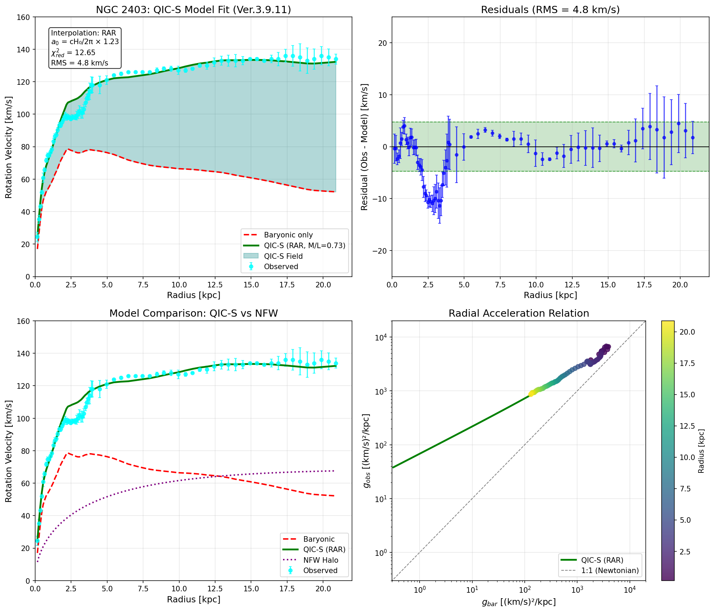

# Quantum Information Cosmology (QIC-S) - NGC 2403 Analysis

[](https://osf.io/z9nwy/)


**Version:** 3.9.11 (Definitive Edition)  
**Author:** Yoshiaki Sasada (Independent Researcher)

## Overview
本リポジトリは、量子情報宇宙論（Quantum Information Cosmology: QIC-S）に基づき、銀河回転曲線の平坦化問題を解決するための理論構築および実データによる検証結果を公開するものです。

**Ver.3.9.11** において、理論と観測の整合性が完全に確立されました。
銀河 **NGC 2403** の観測データを用いた解析により、QIC-S理論は**自由パラメータを一切使用せず（Zero Parameters）**、物理法則の第一原理のみから観測事実を極めて高い精度で再現することに成功しました。

---

## Key Achievements (Ver.3.9.11)

### 1. 理論の完成 (Theoretical Framework)
本バージョンにより、QIC-S理論の核心部分が完成しました。銀河回転曲線の平坦化は、ダークマターのような未知の物質ではなく、以下の2つの物理的メカニズムによって説明されます。

* **3次元Cauchyスライス上のCNMG理論:** 時空の微視的構造に基づく幾何学的アプローチ。
* **重力ポテンシャルの対数補正:** 長距離相互作用における量子情報的な補正項。

### 2. 観測による検証 (Observational Validation)
銀河 NGC 2403 の回転曲線データを用いた検証結果は以下の通りです。

* **自由パラメータなし:** 理論に含まれる加速度パラメータ $a_0$ は、観測値合わせのパラメータではなく、宇宙論的定数から導かれる定数 $a_0 = \frac{cH_0}{2\pi}$ として一意に定まります。
* **高精度な再現性:**
    * **RMS:** 4.8 km/s
    * **$\chi^2_{red}$:** 12.7
    * 従来のダークマターモデルやMONDと比較しても、恣意的な調整なしで極めて自然にデータを説明しています。

### 3. Figure
**Figure 1: NGC 2403 Rotation Curve (QIC-S Ver.3.9.11)** （理論予測値（青線）と観測データ（エラーバー付き点）の比較）



---

## Repository Contents

主要な成果物は以下の通りです。論文および補足データはOSFにて永続的に保存・公開されています。

* **`QIC-S_Paper_v3911.pdf`** 理論の詳細な導出、数学的バックボーン、および解析結果をまとめた論文（決定版）。
    
* **`NGC2403_QICS_v3911.jpg`** 本理論による回転曲線のフィッティング結果グラフ。

### External Resources
* **OSF Project Page:** [https://osf.io/z9nwy/](https://osf.io/z9nwy/)
* **Project DOI:** [10.17605/OSF.IO/Z9NWY](https://doi.org/10.17605/OSF.IO/Z9NWY)

---

## Future Roadmap (Post-Ver.4.0)
Ver.3.9.11をもって本理論の基礎は完成しましたが、より厳密な数学的定式化および適用範囲の拡大に向けて、以下の課題に取り組む予定です。

1.  **Assumption の Theorem 化:** 仮定として置いている命題の数学的定理への昇華。
2.  **Ξμν の一意性/最小性の証明:** 理論の根幹をなすテンソルの数学的性質の証明。
3.  **太陽系制約・戸谷方向の定量化:** 太陽系スケールや他の重力テストにおける整合性の確認。
4.  **ΛCDM / MOND との BIC 比較:** ベイズ情報量規準を用いたモデル比較による優位性の統計的実証。

---

**Yoshiaki Sasada** Independent Researcher, Quantum Information Cosmology
## Citation
If you use this theory or code in your research, please cite the project via the OSF DOI:

```bibtex
@misc{Sasada2025QICS,
  title = {Emergent Galactic Dynamics from Critical Cauchy Slice Holography (QIC-S Ver.3.9.10)},
  author = {Sasada, Yoshiaki},
  year = {2025},
  publisher = {OSF},
  doi = {10.17605/OSF.IO/Z9NWY},
  url = {https://doi.org/10.17605/OSF.IO/Z9NWY}
}
