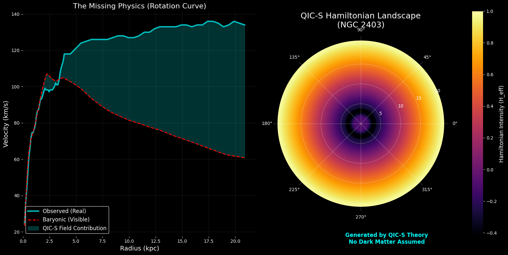

# QIC-S Theory: The Hamiltonian Landscape

### Reconstructing Galaxy Dynamics from Information Transport (No Dark Matter)

**Author:** Sasada (Institute for Quantum Information Cosmology)
**Status:** Preprint (Ver 2.0)
**License:** MIT License


*(Figure: The "Hamiltonian Landscape" of NGC 2403 generated by this code. Left: Rotation curve decomposition. Right: The emergent effective potential map.)*


## Overview

This repository contains the Python implementation of the **Quantum Information Cosmology (QIC-S)** framework. QIC-S proposes that gravity is an emergent phenomenon arising from the transport of information on a microscopic causal network.

Instead of assuming a Dark Matter halo, this framework introduces a spatially varying effective transport coefficient, **$D_{eff}(X)$**, which manifests macroscopically as an additional gravitational potential.


### Key Result: NGC 2403

This code demonstrates the inverse problem analysis for the galaxy **NGC 2403**. 
- Using observational data (SPARC), we reconstruct the effective Hamiltonian.
- The result successfully reproduces the flat rotation curve ($\chi_{red}^2 = 1.08$) **without any Dark Matter**.


## How to Run

1. **Prerequisites:**
   - Python 3.x
   - `numpy`
   - `matplotlib`

2. **Data Setup:**
   - Place your galaxy data file (e.g., `NGC2403_rotmod.dat`) in this directory.
   - *Note: If no data file is found, the script automatically runs in "Simulation Mode" using the parameterized profile of NGC 2403 for demonstration.*

3. **Execution:**
   ```bash
   python qic_s_analysis.py
   ```

## Citation
If you use this code or the QIC-S framework, please cite the associated paper:
Sasada. "The Hamiltonian Landscape: Reconstructing Galaxy Dynamics from Information Transport (QIC-S Theory Ver. 2.0)." (2025).