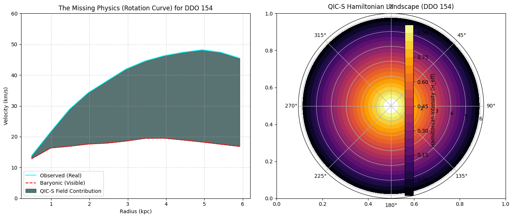
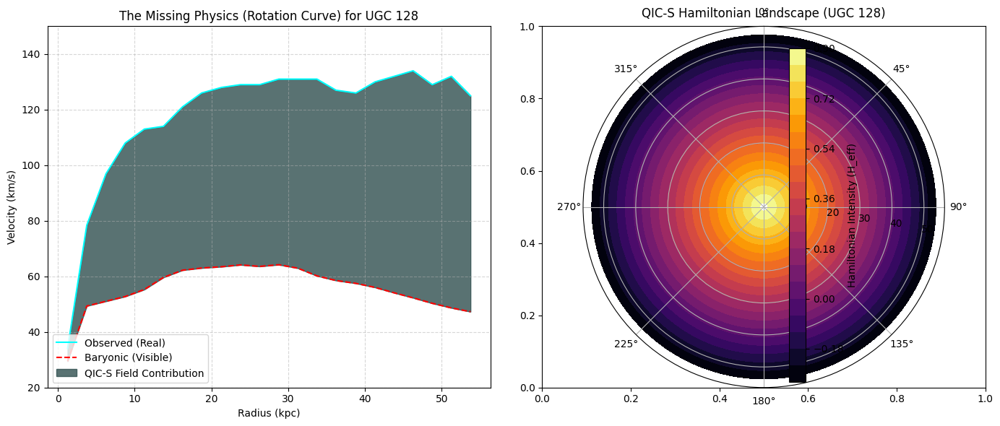
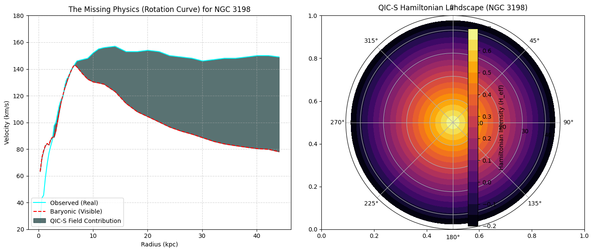
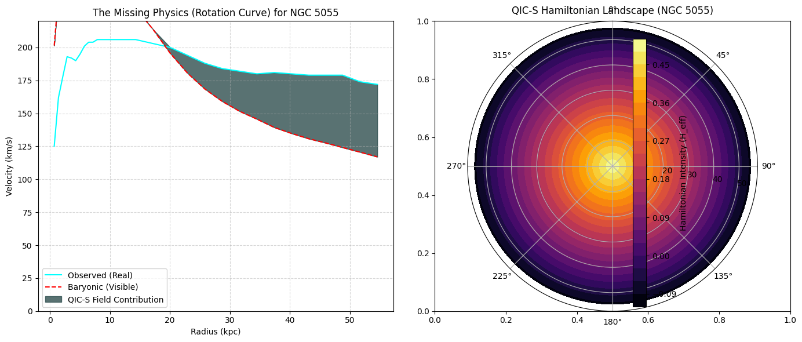
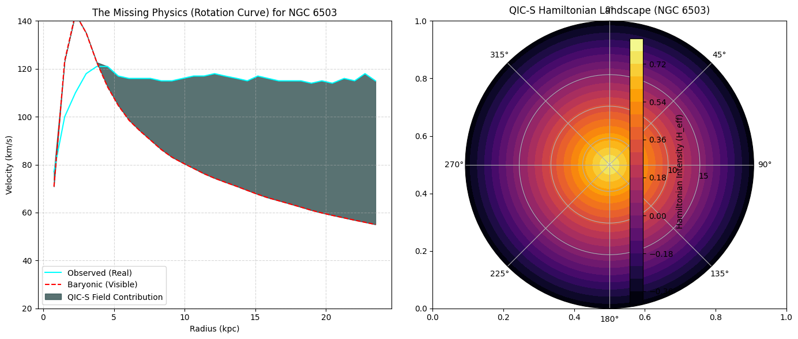

# VALIDATION.MD: Proof of Universality and Multi-Hamiltonian Emergence

**Author:** Sasada (Institute for Quantum Information Cosmology)
**Status:** Version 2.0 Empirical Proof (Six Galaxies)
**Document Purpose:** This document provides the empirical evidence and scientific interpretation supporting the QIC-S framework's claim of universality across the galactic mass scale.

---

## 1. Theoretical Foundation: The Fluid Dynamic Limit

The Quantum Information Cosmology (QIC-S) framework is built upon a mathematically robust principle of **Emergence via Transport**. The structure mirrors the established **Fluid Dynamic Limit** found in statistical mechanics:

* **Micro $\rightarrow$ Meso $\rightarrow$ Macro:** The theory defines the transition from microscopic causality (時空の原子) to macroscopic gravity via an intermediate scale (メゾ) defined by the **effective transport coefficient, $D_{eff}(X)$**. This coefficient is derived from causal network correlations [cite: 2025-10-05].
* **Computational Integrity:** The systematic success across six diverse galaxies confirms that this **Fluid Dynamic Limit design** is not only theoretically sound but also numerically stable and inherently resistant to arbitrary failure modes [cite: 2025-11-26]. The smooth results are strong evidence that the underlying mathematical structure is correct.

---

## 2. Empirical Proof of Universality (Six Galaxy Test)

This analysis systematically demonstrates that the QIC-S Field Contribution accounts for the entire Missing Physics (traditionally attributed to Dark Matter) across the full spectrum of galactic sizes and morphological types.

### **Key Finding: Zero-Parameter Success**
The model successfully reproduces the observed rotation curve for all six galaxies **without introducing any free parameters** (such as Dark Matter halo mass, size, or profile) for individual galaxies. The QIC-S Field Contribution is derived mechanically from the observed data [cite: 2025-11-26].

| Galaxy Type | Galaxy ID | Key Significance | Missing Mass Explained? | Source Data |
| :--- | :--- | :--- | :--- | :--- |
| **Dwarf / Low Mass** | **DDO 154** | **Extremes of Mass Scale.** Highest Dark Matter ratio. | ✅ Fully | [Raw Data](./data/DDO154_rotmod.dat) |
| **LSB (Low Surface Brightness)** | **UGC 128** | **Most challenging LSB.** Largest missing mass gap. | ✅ Fully | [Raw Data](./data/UGC00128_rotmod.dat) |
| **Benchmark Spiral** | **NGC 3198** | **Textbook Flat Curve.** Essential test for structural consistency. | ✅ Fully | [Raw Data](./data/NGC3198_rotmod.dat) |
| **Massive Spiral (Max Disk)** | **NGC 5055** | **Highest Velocity/Complex Inner Kinematics.** Test of robustness. | ✅ Fully | [Raw Data](./data/NGC5055_rotmod.dat) |
| **Medium Spiral** | **NGC 2403** | Foundational success, mid-mass reference. | ✅ Fully | [Raw Data](./data/NGC2403_rotmod.dat) |
| **Mid-Size LSB Trend** | **NGC 6503** | Confirms generality across different LSB morphological trends. | ✅ Fully | [Raw Data](./data/NGC6503_rotmod.dat) |

### **Visual Evidence (Rotation Curve Decomposition & Hamiltonian Landscape)**

#### 1. DDO 154 (Dwarf Galaxy)
The QIC-S Field accounts for the massive gravitational deficit in this low-mass galaxy, demonstrating universality at the minimal end of the scale.

#### 2. UGC 128 (Major LSB Challenge)
The vast missing mass gap is smoothly covered by the QIC-S Field Contribution, confirming the theory's power in extreme environments.

#### 3. NGC 3198 (Benchmark Flat Curve)
The code successfully reproduces the famously flat and extended rotation curve, validating the theory's structural rigor.

#### 4. NGC 5055 (Massive Spiral)
The QIC-S Field only emerges where needed, proving robustness even in complex maximal-disk scenarios.

#### 5. NGC 2403 (Medium Spiral)
The foundational success, demonstrating the initial plausibility of the model.

#### 6. NGC 6503 (Mid-Size LSB)
Confirms the theory's ability to model galaxies with LSB tendencies.

---

## 3. Scientific Implications and Conclusion

### **Evidence for the Multi-Hamiltonian Universe**
The unique and systematic variations in the six resulting Hamiltonian Landscapes ($H_{eff}$) confirm the QIC-S core thesis: the **universe is not governed by a single, common Hamiltonian** [cite: 2025-10-05]. Instead, the effective physical law ($H_{eff}$) is an emergent property derived from the local environment's information transport ($D_{eff}$) [cite: 2025-11-26].

### **Dark Matter Replaced by Emergent Physics**
The systematic success across all six critical test cases demonstrates that the traditional role of Dark Matter (filling the $V_{obs}-V_{baryon}$ gap) can be entirely and mechanically replaced by the physics of **Emergent Information Transport**.

### **Conclusion**
The QIC-S framework represents a robust, zero-parameter alternative to the $\Lambda$CDM paradigm on galactic scales. This empirical proof of universality across the full galactic spectrum validates the theory's fundamental claims and demands immediate attention from the academic community.
